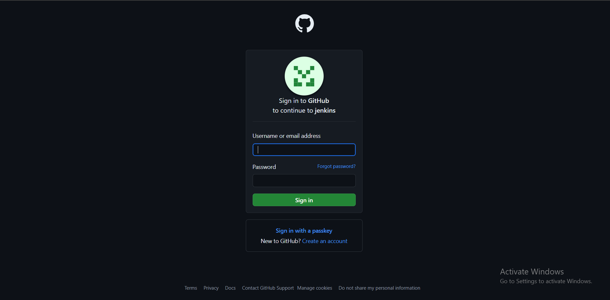

## Jenkins Configurations as Code to create Github-oauth for Jenkins login

  

1. **Jenkins-Dockerfile: Create and publish jenkins Image that includes**:
   - required plugins in _plugins.txt_ and
   - Directory for to store JCasC yaml files.
Here, I have created git-hub action to build and publish image when push changes to plugin.txt.
     
2. **terraform/user_data.sh : User data script for EC2 userdata**:
   - Install openjdk 
   - install docker
   - run jenkins-container

3. **Terraform apply**

4. **Create Github Oauth app**:
   - Go to github settings>developer>oauth-app
   - Homepage URL : http://ec2-pub-ip:8080
   - Authorization callback url: http://ec2-pub-ip:8080/securityRealm/finishLogin
   - Get **Client ID** and **Client Secret ID**

5. **jenkins.yaml**
  - update the Client ID and Client Secret ID in the jenkins.yaml file in the repo.     

6. **Copy jenkins.yaml into jenkins-container** :
   - ssh into EC2 instance and run commands:
   ```
   git clone https://github.com/VishnuSharma11D00/DevOps-CICD.git
   ```
   ```
   docker cp DevOps-CICD/Github-oauth_using_JCasC/jenkins.yaml jenkins-container:/var/jenkins_home/casc_configs/jenkins.yaml
   ```
   
7. **Apply JCasC** :
    - open jenkins form http://ec2-pub-ip:8080 
    - **Manage Jenkins** > **Jenkins Configuration as Code** > give path of your JCasC yaml file **/var/jenkins_home/casc_configs/jenkins.yaml**
    - apply configurations


### Further Customization:
1. Using GitHub actions
   - to build and publish jenkins image.
   - Update image version in user-data code.
   - Trigger terraform form GitHub actions. 
2. Using github link form JCaC instead of doing docker cp into jenkins container.

# Handling Secrets and Credentials:
- Since it is a demo project, I have directly written the GitHub Oauth credentials in the jenkins.yaml code. which is not a best practice.
- One option is, create docker secrets and you can pass them as variables in JCasC yaml code, and jenkins can resolve them. For more options and details please refer the official jenkins links:
   - https://github.com/jenkinsci/configuration-as-code-plugin/tree/master/demos/credentials
   - https://github.com/jenkinsci/configuration-as-code-plugin/blob/master/docs/features/secrets.adoc#secret-sources
      
