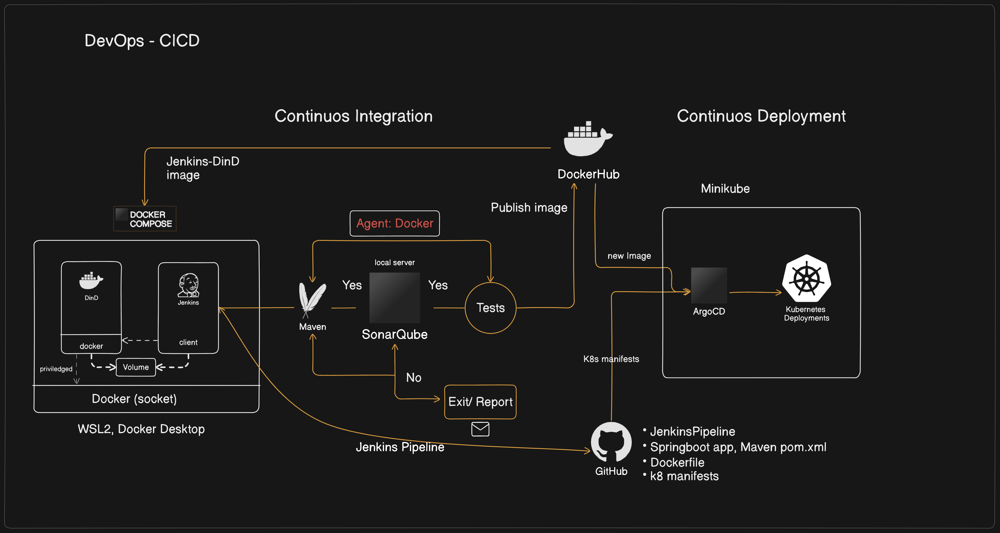

# Jenkins Pipeline for Java based application using Maven, SonarQube, Argo CD, Helm and Kubernetes

## Repo description:
- Jenkins-DinD:
  1. docker-compose.yaml and Dockerfile for Jenkins codes
- spring-boot-app :
  1. Sample App code
  2. Dockerfile
  3. JenkinsFile - Groovy code for jenkins pipeline
  4. pom.xml
- spring-boot-app-manifests :
  1. Deployment and service yaml fie for kubernetes. This can also be in a different repo.

## Customization:
1. Kubernetes as a Jenkins Agent: Instead of running Jenkins agents in Docker containers within Jenkins, you could use the Kubernetes plugin for Jenkins. This allows Jenkins to dynamically provision and de-provision pods on a Kubernetes cluster as Jenkins agents. This setup is more scalable and reduces the need to manage Docker-in-Docker complexity.
Pod Templates: Define pod templates in Jenkins for different stages. Each stage can use a different container image, reducing the need for a multi-agent setup within a single pipeline.

2. Using Helm charts with Kubernetes to simplify the deployment process. And setup ArgoCD to deploy helm charts.
